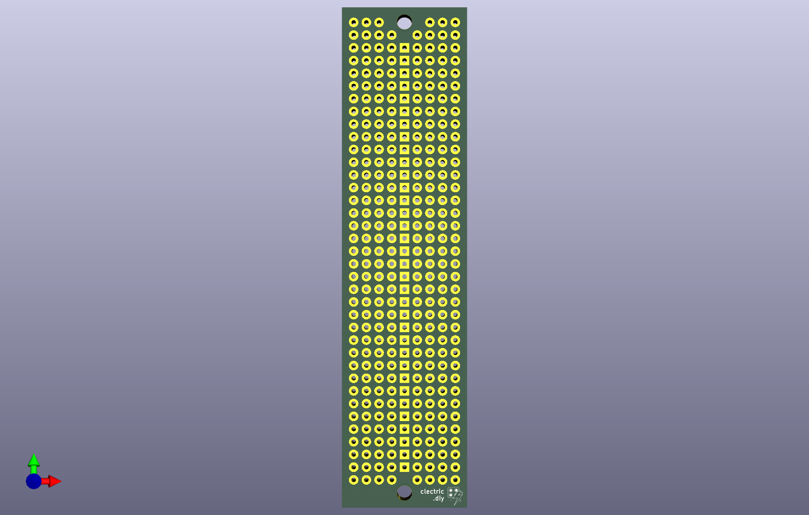
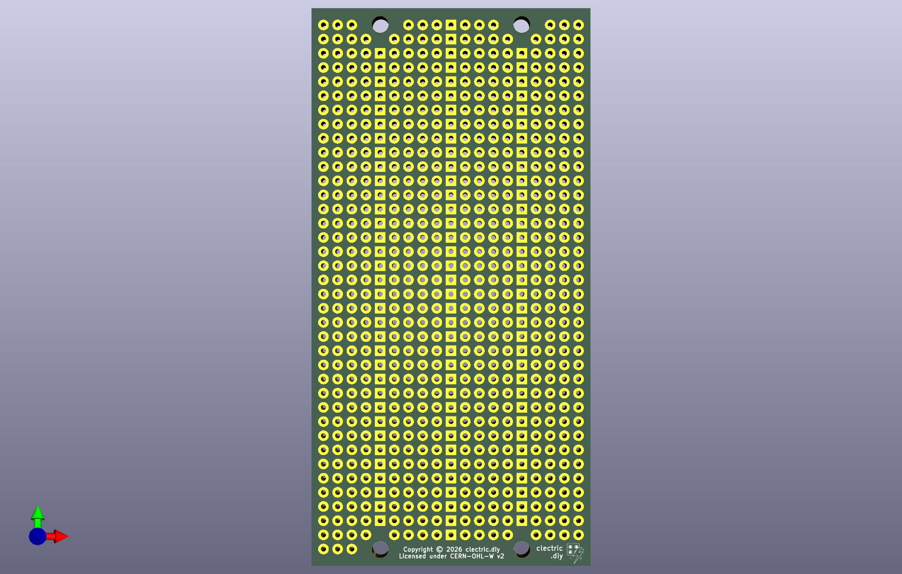

These protoboards are available for purchase at [store.clectric.diy](https://store.clectric.diy).

We have 1U and 2U protoboards, for the [AE Modular format](https://clectric.diy/formats/ae-modular/), ready to go for your next Synth DIY project.

These designs are open hardware under the [CERN-OHL-W](https://gitlab.com/ohwr/project/cernohl/-/wikis/uploads/82b567f43ce515395f7ddbfbad7a8806/cern_ohl_w_v2.txt).

This is the "weakly reciprocal" variant. You can use this hardware, under the terms of that variant, as a component wihin hardware that you build and sell.

NOTE: These designs have been created to work with the AE Modular format. It is an independent creation and is not affiliated with or endorsed by Tangible Waves. All trademarks are the property of their respective owners and are referenced only to indicate compatibility.
